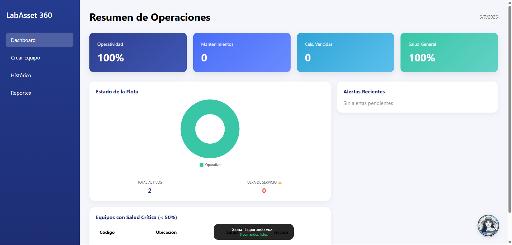
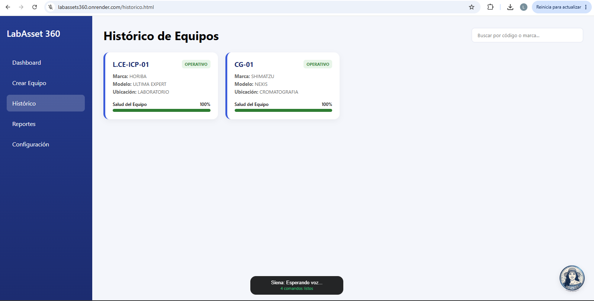
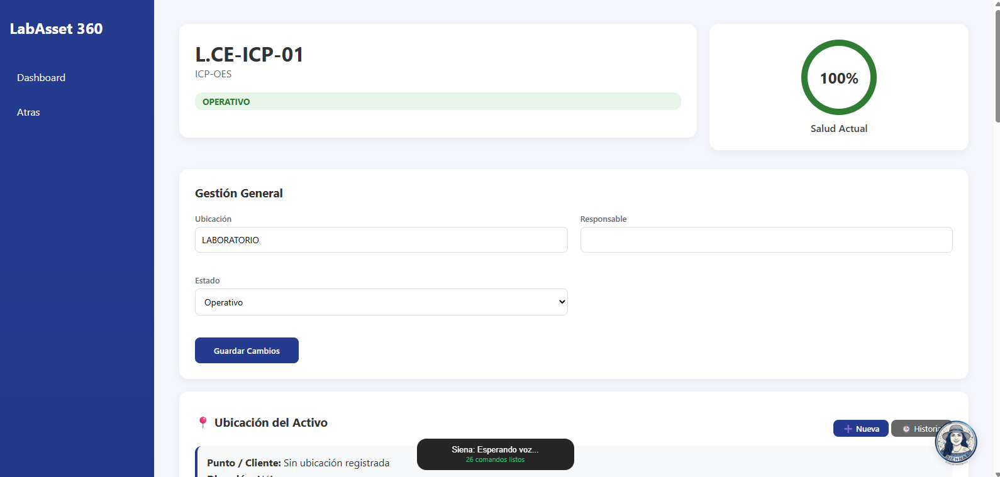

*LabAsset 360*

LabAsset 360 es una solución integral diseñada para la gestión de equipos de laboratorio, donde el sistema permite el control del inventario, seguimiento del ciclo de vida, gestión de prestamos, reportes de fallas y evaluación de cumplimiento tecnico bajo estandares ISO 17025. 

**Stack Tecnológico**

*Backend:* Python con FastAPI
*Base de datos:* PostgreSQL
*ORM:* SQLAlchemy para mapeo de objetos relacionales
*Autenticación:* JWT para sesiones y Argon2 para el hashing de contraseñas
*Frontend:* HTML5, CSS3, Chart.js para visualización de datos y QRCode.js

**Modelo de Datos ORM**

El sistema utiliza un esquema relacional para mantener la integridad de los activos y sus operaciones asociadas con las siguientes entidades:

*Equipo:* Entidad central que almacena marca, modelo, serial, estado operativo e indice de salud

*Mantenimiento:* Registra historial de mantenimientos preventivos/correctivos, tecnicos responsables y costos

*Calibración:* Gestión de certificados, proveedores y fechas de calibración 

*Prestamo:* Control de salidas y entradas de equipos incluyendo condiciones de entrega

*Usuario:* Gestión de acceso y niveles de laboratorio

*Falla:* Reportes de incidencias técnicas que afectan el indice de salud

*Evaluación:* Registro de pruebas tecnicas y resultados de cumplimiento

**Logica de Negocio y Algoritmos**

La característica principal es el indice de salud, un calculo dinamico que evalúa  la confiabilidad del equipo. Este índice final (escalado de 0 a 100) es una composición ponderada de múltiples factores analíticos y operativos:  

*Cálculo de Weibull (40%):* El núcleo estadístico del índice utiliza una distribución de Weibull basada en el tiempo de operación. El parámetro de forma ($\beta$) se ajusta dinámicamente según la frecuencia histórica de fallas del equipo, modelando la probabilidad de supervivencia

*Índice por Mantenimiento (20%):* Aplica penalizaciones algorítmicas proporcionales por mantenimientos preventivos vencidos

*Índice por Calibración (20%):* Evalúa el estado metrológico aplicando la misma lógica de penalización temporal que el módulo de mantenimiento.

*Cumplimiento ISO (10%):* Cuantifica el estado actual de las pruebas técnicas frente a la normativa.  *Disponibilidad (10%):* Factor que refleja la disponibilidad física inmediata (Operativo, En revisión o En Préstamo).

**Roadmap de IA**

Actualmente el indice de salud se apoya en un modelo estadistico parametrico y reglas de negocio deterministas para evaluar la confiabilidad, las calibraciones y el cumplimiento normativo ISO 17025, pero la evolución de este sistema contempla la transición hacia un motor de Machine Learning estructurado en las siguientes fases:

*Fase 1: Ingenieria de Caracterisiticas:*

Creación de pipelines en Python para transformar el historico de la base de datos relacional en un dataset estructurado, se calcularán metricas dinamicas como el tiempo promedio entre fallas y la deriva instrumental 

*Fase 2: Predicción de V.U.R:*

Se sustituye progresivamente la ponderación de Weibull por modelos de aprendizaje supervisado como Random Forest o XGBoost y modelos de analisis de supervivencia con el objetivo de predecir con exactitud el tiempo restante antes de que un equipo alcance un estado de falla o requiera intervención

*Fase 3: Optimización Metrologica Dinamica*

Se implementa un algoritmo que analice el comportamiento historico de las evaluaciones tecnicas, en lugar de depender de fechas de calibración fijas, el modelo sugiere intervalos de calibración dinamicos, maximizando la integridad analitica y garantizando el cumplimiento ISO con mayr eficiencia.

*Fase 4: Despliegue*

Se integra los modelos entrenados directamente en la arquitectura actual de FastAPI desarrollando nuevos endpoints asincronos que recalculen las predicciones en tiempo real cada vez que un técnico de laboratorio registre una nueva lectura o una falla. 

**Capturas del Aplicativo**

